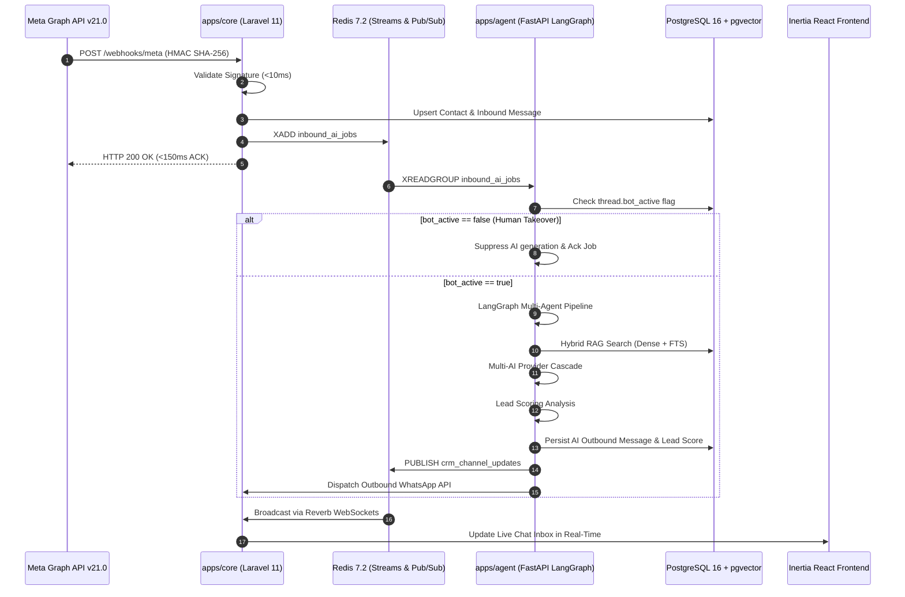
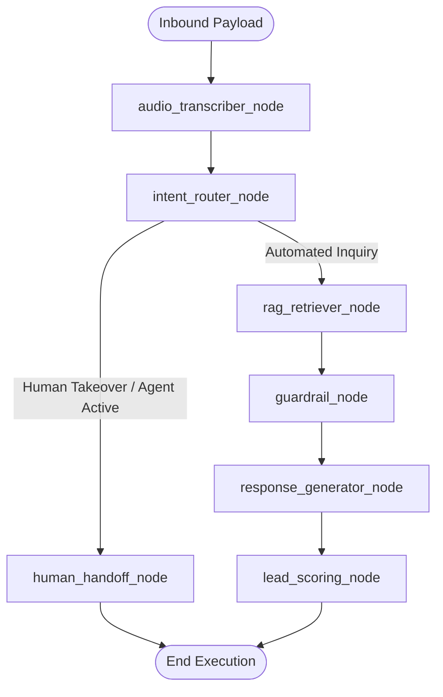

# System Architecture Specification — RAVISN Platform

## 1. High-Level Monorepo Structure

```text
ravisn-platform/
├── apps/
│   ├── core/                          # Laravel 11 CRM, Inertia React 19, Meta Gateways
│   │   ├── app/                       # Controllers, Models, Jobs, Services, Events
│   │   ├── config/                    # Framework configuration
│   │   ├── database/                  # 22 Consolidated PostgreSQL Migrations & Seeders
│   │   ├── resources/js/              # React 19 Frontend UI (Inertia.js + Tailwind CSS)
│   │   └── tests/                     # Pest PHP Feature & Unit Test Suite
│   └── agent/                         # FastAPI Python 3.11 Cognitive Intelligence Engine
│       ├── src/
│       │   ├── api/                   # REST API routes (/health, /chat, /knowledge, /process)
│       │   ├── graph/                 # LangGraph StateGraph, Typed AgentState, and Nodes
│       │   ├── db/                    # SQLAlchemy asyncpg PostgreSQL session & models
│       │   ├── scoring/               # Rule-based Lead Scoring Engine
│       │   ├── services/              # LLM Factory, Hybrid Retriever, Audio Service
│       │   └── workers/               # Redis Stream Consumer (inbound_ai_jobs)
│       └── tests/                     # Pytest Unit & Integration Suite
├── deploy/
│   ├── backup_postgres.sh             # Automated PostgreSQL + pgvector backup routine
│   ├── restore_postgres.sh            # Database restoration script
│   ├── nginx/conf.d/ravisn.conf       # High-performance reverse proxy configuration
│   └── supervisor/                    # Multi-worker process management
├── scripts/                           # Outbound, Inbound, ASR, RAG, & RAGAS Benchmarks
├── docker-compose.yml                 # 7-Container Production Topology
└── .github/workflows/ci.yml           # CI/CD Automated Test Matrix
```

---

## 2. Inbound Message Event Lifecycle



---

## 3. LangGraph Cognitive StateGraph Architecture

The autonomous intelligence layer in `apps/agent` is organized as a directed acyclic state graph (`CompiledStateGraph`):



### Node Responsibilities:
1. **`audio_transcriber_node`**: Detects audio/voice note payloads and executes Groq Whisper / Faster-Whisper ASR, attaching transcription and latency metrics to telemetry.
2. **`intent_router_node`**: Classifies query intent (`sales`, `support`, `pricing`, `human_agent`, `general`).
3. **`human_handoff_node`**: Enforces staff takeover rules, marks threads as `agent_active`, and triggers real-time handoff notifications.
4. **`rag_retriever_node`**: Executes dense cosine similarity search over `pgvector` chunks combined with PostgreSQL full-text search, applies cross-encoder reranking, and runs Corrective RAG (CRAG) context grading.
5. **`guardrail_node`**: Validates input/output bounds, zero-pricing protection, and channel constraints.
6. **`response_generator_node`**: Leverages the Multi-AI Cascade (Groq $\rightarrow$ Gemini $\rightarrow$ xAI $\rightarrow$ OpenAI) to synthesize answers grounded in retrieved context.
7. **`lead_scoring_node`**: Evaluates conversation signals, assigns engagement scores (0-100), and categorizes contacts into `cold`, `warm`, `hot`, or `qualified`.
